 

 

### `{ stack }`

ดูรายการเป็นข้อความ / text version

 

**Languages** — JavaScript · TypeScript · C# · Go · Python · PHP · HTML5 · CSS3
**Frontend** — React · Next.js · Vue · Angular · Tailwind CSS · Bootstrap · MUI · Vite
**Backend** — Node.js · FastAPI · Django · .NET · Flutter
**Data & Cloud** — MongoDB · MySQL · PostgreSQL · Azure · Docker
**Tools** — Git · VS Code · Figma · Raspberry Pi · Arduino

 

### `{ activity }`

 

### `{ now }`

<table>
  <tr>
    <td align="center" width="260"><b>🌱 Learning</b> DevOps · Cloud Architecture Docker · AI</td>
    <td align="center" width="260"><b>🤝 Open to</b> Interesting full-stack & web projects</td>
    <td align="center" width="260"><b>🏸 Off duty</b> Badminton & football after dark</td>
  </tr>
</table>

 

### `{ connect }`

  

